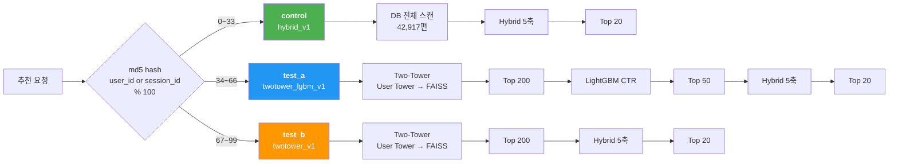
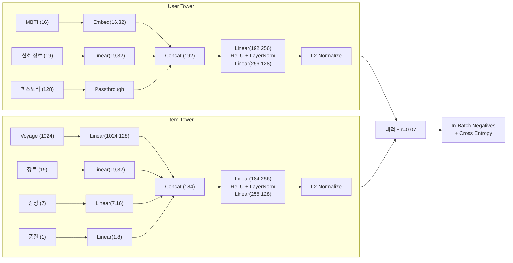
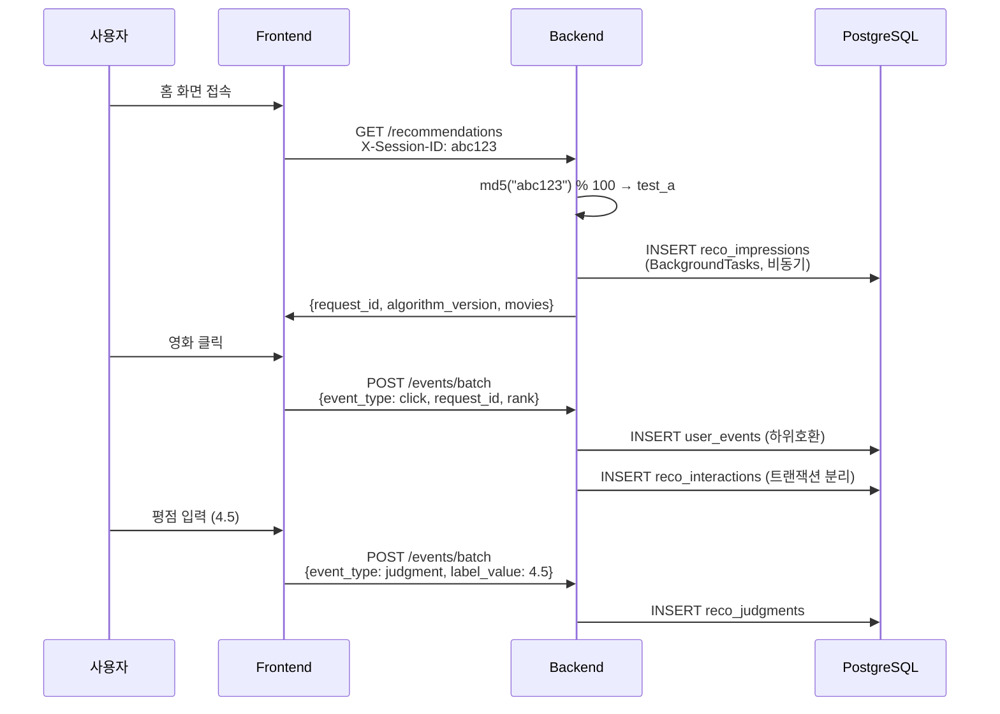

# RecFlix 시스템 아키텍처

> v2.0 업데이트: 2026-03-03 — ML 추천 파이프라인, A/B 실험 프레임워크, 다크/라이트 모드

## 전체 구조

```
┌──────────────────────────────────────────────────────────────────┐
│                         Client (Browser)                        │
│  Geolocation → useWeather → 날씨 기반 추천                       │
│  Zustand (auth, interaction, theme, mood) → Optimistic UI        │
│  eventTracker → Beacon API → 행동 이벤트 배치 전송                │
└──────────────────┬───────────────────────────────────────────────┘
                   │ HTTPS
┌──────────────────▼───────────────────────────────────────────────┐
│                    Vercel (Frontend)                              │
│  Next.js 14 App Router                                           │
│  - SSR: generateMetadata (OG 메타태그)                            │
│  - CSR: 홈/검색/상세/프로필 (동적 콘텐츠)                          │
│  - Sentry (에러 모니터링)                                         │
└──────────────────┬───────────────────────────────────────────────┘
                   │ REST API (/api/v1/*)
┌──────────────────▼───────────────────────────────────────────────┐
│                    Railway (Backend)                              │
│  FastAPI + Uvicorn                                               │
│  ┌─────────────────────────────────────────────────────────────┐ │
│  │ Middleware Stack                                             │ │
│  │  CORS → RequestIDMiddleware → slowapi Rate Limiter          │ │
│  └─────────────────────────────────────────────────────────────┘ │
│  ┌─────────────────────────────────────────────────────────────┐ │
│  │ API Router (/api/v1/)                                       │ │
│  │  recommendations │ movies │ auth │ ratings │ collections    │ │
│  │  events │ users │ weather │ health │ llm │ interactions     │ │
│  └─────────────────────────────────────────────────────────────┘ │
│  ┌─────────────────────────────────────────────────────────────┐ │
│  │ Core Services                                               │ │
│  │  recommendation_engine │ semantic_search │ diversity         │ │
│  │  recommendation_cf │ recommendation_reason                  │ │
│  └─────────────────────────────────────────────────────────────┘ │
│  structlog (JSON/console) │ Sentry │ Alembic                    │
└────────┬────────────┬────────────┬───────────────────────────────┘
         │            │            │
    ┌────▼────┐  ┌────▼────┐  ┌───▼──────────────┐
    │PostgreSQL│  │  Redis  │  │  External APIs   │
    │ 42,917편 │  │  캐시   │  │  Voyage AI       │
    │ 6 tables │  │  세션   │  │  Claude API      │
    │ GIN idx  │  │  JTI   │  │  OpenWeatherMap   │
    └─────────┘  └─────────┘  │  TMDB API        │
                              └──────────────────┘
```

## 데이터 흐름: 홈 추천 요청

```
1. 사용자 브라우저
   ├── Geolocation API → 위도/경도 획득
   ├── useWeather() → GET /weather?lat=&lon= → 날씨 상태 (sunny/rainy/...)
   └── 홈 페이지 로드

2. GET /api/v1/recommendations?weather=sunny&mood=relaxed&mbti=INFP
   ├── JWT 검증 (로그인 시) → current_user
   ├── 품질 필터: weighted_score >= 6.0
   ├── 연령등급 필터: age_rating 매핑
   └── 섹션별 추천 생성:
       ├── popular: popularity DESC (TOP 50, 셔플 20)
       ├── top_rated: weighted_score DESC (TOP 50)
       ├── weather: weather_scores JSONB 쿼리
       ├── mood: emotion_tags JSONB 쿼리
       ├── mbti: mbti_scores JSONB 쿼리
       └── hybrid: 5축 하이브리드 스코어링 (로그인 시)

3. 하이브리드 스코어링 (recommendation_engine.py)
   ├── MBTI Score: mbti_scores[user.mbti] x 가중치
   ├── Weather Score: weather_scores[weather] x 가중치
   ├── Mood Score: emotion_tags[cluster] x 가중치
   ├── Personal Score: 찜/고평점 장르 매칭 x 가중치
   ├── CF Score: SVD item_bias 정규화 x 가중치
   └── Quality: weighted_score 연속 보정 (x0.85~1.0)

4. 다양성 후처리 (diversity.py)
   ├── diversify_by_genre: 장르 캡 (연속 동일 장르 제한)
   ├── ensure_freshness: 신선도 보장 (최신 영화 우대)
   ├── inject_serendipity: 의외의 발견 삽입
   └── deduplicate_section: 섹션 간 중복 제거

5. 추천 이유 생성 (recommendation_reason.py)
   └── 43개 템플릿 매칭 → 한국어 추천 이유 텍스트

6. 응답 → 프론트엔드 렌더링
   ├── MovieRow: 가로 스크롤 영화 카드
   ├── HybridMovieRow: 추천 태그 + 추천 이유
   └── 큐레이션 서브타이틀 (258개 문구 중 매칭)
```

## 데이터베이스 스키마

```
┌─────────────┐     ┌──────────────┐     ┌──────────────┐
│   movies    │     │    users     │     │  user_events │
│ (42,917행)  │     │  (17컬럼)    │     │  (10종)      │
├─────────────┤     ├──────────────┤     ├──────────────┤
│ id (PK)     │     │ id (PK)      │     │ id (PK)      │
│ title       │     │ email (UQ)   │     │ user_id (FK) │
│ title_ko    │     │ hashed_pw    │     │ event_type   │
│ overview    │     │ mbti         │     │ event_data   │
│ poster_path │     │ kakao_id     │     │  (JSONB)     │
│ vote_avg    │     │ google_id    │     │ session_id   │
│ popularity  │     │ auth_provider│     │ page_url     │
│ cast_ko     │     │ experiment_  │     │ created_at   │
│ director_ko │     │   group      │     └──────────────┘
│ trailer_key │     │ preferred_   │
│ mbti_scores │     │   genres     │     ┌──────────────┐
│  (JSONB)    │     │ onboarding_  │     │   ratings    │
│ weather_    │     │   completed  │     ├──────────────┤
│  scores     │     └──────┬───────┘     │ user_id (FK) │
│  (JSONB)    │            │             │ movie_id(FK) │
│ emotion_    │            │             │ score (0.5~5)│
│  tags       │     ┌──────▼───────┐     │ (UQ: u+m)   │
│  (JSONB)    │     │ collections  │     └──────────────┘
│ weighted_   │     ├──────────────┤
│  score      │     │ user_id (FK) │     ┌───────────────┐
└──────┬──────┘     │ name         │     │similar_movies │
       │            └──────────────┘     ├───────────────┤
       │                                 │ movie_id (FK) │
  ┌────▼─────┐                           │ similar_id(FK)│
  │  M:M     │                           │ similarity    │
  │ tables   │                           │ (429,170행)   │
  ├──────────┤                           └───────────────┘
  │ genres   │
  │ persons  │
  │ keywords │
  │ countries│
  └──────────┘
```

### JSONB 인덱스 (GIN)
```sql
CREATE INDEX idx_movies_mbti ON movies USING GIN(mbti_scores);
CREATE INDEX idx_movies_weather ON movies USING GIN(weather_scores);
CREATE INDEX idx_movies_emotion ON movies USING GIN(emotion_tags);
```

## 캐시 전략

| 캐시 계층 | TTL | 대상 |
|-----------|-----|------|
| **Redis** | 30분 | 날씨 API 응답 |
| **Redis** | 1시간 | 자동완성 결과 |
| **Redis** | 24시간 | LLM 캐치프레이즈 |
| **Redis** | 7일 | refresh_token JTI (토큰 회전) |
| **프로세스 캐시** | 앱 수명 | 시맨틱 검색 임베딩 (NumPy 배열) |
| **프로세스 캐시** | 앱 수명 | SVD 모델 (item_bias, global_mean) |
| **localStorage** | 10분 | 날씨 데이터 (프론트엔드) |
| **localStorage** | 영속 | 인증 토큰 (Zustand persist) |

## 인증 흐름

### JWT + Refresh Token 회전
```
1. POST /auth/login → { access_token (30분), refresh_token (7일) }
2. refresh_token JTI를 Redis에 저장 (1회용)
3. access_token 만료 시:
   POST /auth/refresh → 새 access_token + 새 refresh_token
   이전 JTI 무효화 + 새 JTI 저장
4. 탈취 감지: 이미 사용된 JTI로 요청 시 → 전체 세션 무효화
```

### OAuth 소셜 로그인
```
1. Frontend → 카카오/Google 인증 페이지 리다이렉트
2. 인증 성공 → 콜백 페이지 (code 파라미터)
3. POST /auth/kakao (or /auth/google) { code }
4. Backend → OAuth 제공자에 토큰 교환 → 사용자 정보 조회
5. DB에 사용자 생성/조회 → JWT 발급
```

## 외부 서비스 의존성

| 서비스 | 용도 | 필수 여부 | 비용 |
|--------|------|-----------|------|
| **OpenWeatherMap** | 실시간 날씨 + 역지오코딩 | 권장 | 무료 (1,000 calls/day) |
| **Voyage AI** | 시맨틱 검색 임베딩 생성 (1회) | 선택 | ~$2 (42,917편) |
| **Claude API** | 감정 태그 분석 + 캐치프레이즈 | 선택 | ~$12 (emotion_tags 1,711편) |
| **TMDB API** | 트레일러 수집 (1회) | 선택 | 무료 |
| **Sentry** | 에러 모니터링 | 선택 | 무료 (5K events/month) |

모든 외부 서비스는 graceful degradation — 설정되지 않거나 장애 시 해당 기능만 비활성화.

## CI/CD 파이프라인

```
git push origin main
       │
       ▼
  GitHub Actions
  ┌─────────────────────────────────────────┐
  │  backend-lint    : ruff check (critical)│
  │  backend-test    : pytest -v --tb=short │
  │  backend-typecheck: pyright (optional)  │
  │  frontend-build  : next build           │
  └────────────────┬────────────────────────┘
                   │ all pass
                   ▼
  deploy-backend: railway up --service backend
  deploy-frontend: Vercel GitHub 연동 (자동)
```

## 로깅

- **structlog** — stdlib logging 통합
- **Production**: JSON one-line (Railway 로그 파싱)
- **Development**: Colored console (human-readable)
- **X-Request-ID**: 모든 요청에 UUID 바인딩 → 로그 추적
- **Noisy loggers**: uvicorn.access, httpx → WARNING 레벨

---

## v2.0 — ML 추천 파이프라인

### 추천 경로 분기 (A/B 실험)



**결정론적 그룹 배정**: `md5(str(user_id))` 또는 `md5(session_id)` 기반으로 동일 사용자는 매 요청마다 항상 같은 그룹에 배정됩니다. 프론트엔드는 `localStorage`에 `recflix_session_id`를 저장하여 비로그인 사용자도 일관된 실험 그룹을 유지합니다.

### Two-Tower 모델 (296,720 파라미터)



- **Loss**: In-Batch Negatives — 배치 내 다른 아이템을 네거티브로 활용 (별도 네거티브 샘플링 불필요)
- **학습**: Synthetic 60,400건 pretrain → Recall@200 = 0.87
- **서빙**: Item Tower 출력 사전계산 (42,917 × 128) → FAISS IndexFlatIP → 0.13ms/query

### LightGBM 재랭커 (76 피처)

| 피처 그룹 | 차원 | 설명 |
|-----------|------|------|
| MBTI one-hot | 16 | 사용자 MBTI 유형 |
| 사용자 장르 | 19 | 선호 장르 멀티핫 |
| 아이템 장르 | 19 | 영화 장르 멀티핫 |
| 아이템 품질 | 1 | weighted_score |
| 감성 태그 | 7 | 7대 감성 클러스터 값 |
| 날씨/기분 | 10 | 컨텍스트 one-hot (4+6) |
| 교차 점수 | 2 | mbti_score, weather_score (사전 계산) |
| 후보 점수 | 2 | tt_score, rank_reciprocal |

피처 중요도: `tt_score` (67.4%) > `rank_reciprocal` (13.8%) > `weighted_score` (3.1%) > `mbti_score` (2.3%)

### Fallback 체계

모든 ML 컴포넌트는 실패 시 기존 Hybrid v1으로 자동 fallback합니다:

| 상황 | algorithm_version | 동작 |
|------|-------------------|------|
| 정상 (control) | `hybrid_v1` | 기존 전체 스캔 |
| 정상 (test_a) | `twotower_lgbm_v1` | TT → LGBM → Hybrid |
| Two-Tower 모델 없음 | `hybrid_v1_fallback` | control과 동일 |
| Two-Tower 후보 < 20 | `twotower_v1_supplemented` | 기존 방식으로 교체 |
| LGBM 모델 없음 | `twotower_v1` | LGBM 스킵 |
| `TWO_TOWER_ENABLED=false` | `hybrid_v1` | ML 로딩 자체 스킵 |

---

## v2.0 — 측정 인프라

### 데이터 수집 파이프라인



### 추가 로그 테이블 (3개)

```
┌──────────────────┐     ┌──────────────────┐     ┌──────────────────┐
│ reco_impressions │     │ reco_interactions│     │  reco_judgments  │
├──────────────────┤     ├──────────────────┤     ├──────────────────┤
│ request_id (UUID)│◀───▶│ request_id (UUID)│◀───▶│ request_id (UUID)│
│ user_id (FK)     │     │ user_id (FK)     │     │ user_id (FK, NN) │
│ session_id       │     │ session_id       │     │ movie_id         │
│ experiment_group │     │ movie_id         │     │ label_type       │
│ algorithm_version│     │ event_type       │     │ label_value      │
│ section          │     │ dwell_ms         │     │ judged_at        │
│ movie_id         │     │ position         │     └──────────────────┘
│ rank             │     │ metadata (JSONB) │
│ score            │     │ interacted_at    │
│ context (JSONB)  │     └──────────────────┘
│ served_at        │
└──────────────────┘
```

핵심 설계:
- **request_id**로 impression → interaction → judgment이 연결
- impression/interaction의 user_id FK는 `SET NULL` (탈퇴 시 로그 보존)
- judgment의 user_id FK는 `CASCADE` (탈퇴 시 함께 삭제)
- movie_id는 FK 없음 (삭제된 영화의 로그도 보존)
- 기존 `user_events` 테이블은 하위호환으로 유지

### 라벨 계층

| Label | 조건 | 의미 |
|-------|------|------|
| 3 | rating ≥ 4.0 또는 favorite_add | Strong Positive |
| 2 | rating 3.0~3.9 또는 dwell ≥ 30s | Positive |
| 1 | rating < 3.0 또는 click/detail_view | Weak Positive |
| 0 | 노출만, 반응 없음 | Negative |

### Temporal Split

시간 기반 분리로 "미래를 맞히는 문제"를 정확하게 시뮬레이션합니다:

```
|-------- Train --------|--- Valid ---|--- Test ---|
                     T-14d         T-7d           T(now)
```

---

## v2.0 — 오프라인 평가 체계

### 평가 지표 (6종 × K=5,10,20)

| 지표 | 설명 | 용도 |
|------|------|------|
| NDCG@K | 순위 품질 (높은 관련성이 상위일수록 높음) | 주요 지표 |
| Recall@K | Top-K에 positive 비율 | 후보 커버리지 |
| MRR@K | 첫 positive의 역순위 | 즉각적 만족도 |
| HitRate@K | Top-K에 positive 1개라도 있으면 1 | 최소 품질 보장 |
| Coverage@K | 추천 장르 다양성 (19종 대비) | 필터 버블 방지 |
| Novelty@K | 비인기 영화 추천 정도 | 탐색 촉진 |

모든 지표에 Bootstrap 95% CI (n=1000) 적용.

### 모델 비교 결과 (Synthetic test, 9,060 samples)

| Model | NDCG@10 | Recall@10 | MRR@10 | Coverage@10 | Novelty@10 |
|-------|---------|-----------|--------|-------------|------------|
| Popularity | 0.233 | 0.325 | 0.564 | 0.456 | 0.41 |
| MBTI-only | 0.284 | 0.386 | 0.610 | 0.384 | 0.51 |
| Hybrid v1 | 0.286 | 0.389 | 0.624 | 0.409 | 0.53 |
| TwoTower+LGBM | 0.285 | 0.390 | 0.624 | 0.428 | 0.54 |

### Ablation Study

| Stage | NDCG@10 | Δ | 의미 |
|-------|---------|---|------|
| Popularity only | 0.233 | - | 개인화 없음 |
| + MBTI | 0.284 | **+22.0%** | 성격 기반 개인화의 핵심 기여 |
| + 5-axis Hybrid | 0.286 | +0.6% | 날씨/기분/CF 미세 개선 |
| + Two-Tower + LGBM | 0.285 | -0.3% | NDCG 유사, Coverage/Novelty ↑ |

> Synthetic 데이터에서 Hybrid와 Two-Tower가 유사한 결과를 보이는 것은 예상된 결과입니다 (click_probability가 score와 동일). 실데이터에서는 Two-Tower의 독립 임베딩 학습이 차이를 만들 것으로 예상됩니다.

### Interleaving (Hybrid v1 vs TwoTower+LGBM)

Team Draft Interleaving으로 두 모델을 공정 비교:
- 114 세션, K=20
- B(TwoTower+LGBM) 승률: 45.3% [95% CI: 35.6%–55.3%]
- CI가 50%를 포함 → 유의미한 차이 없음 (실데이터 필요)

---

## v2.0 환경변수

```env
# A/B 실험 (기본값: 34:33:33)
EXPERIMENT_WEIGHTS=34:33:33

# Two-Tower (없으면 기존 방식으로 fallback)
TWO_TOWER_ENABLED=true
TWO_TOWER_MODEL_PATH=data/models/two_tower/model_v1.pt
TWO_TOWER_INDEX_PATH=data/models/two_tower/faiss_index.bin
TWO_TOWER_MOVIE_MAP_PATH=data/models/two_tower/movie_id_map.json

# LightGBM 재랭커 (없으면 LGBM 스킵)
RERANKER_ENABLED=true
RERANKER_MODEL_PATH=data/models/reranker/lgbm_v1.txt
```